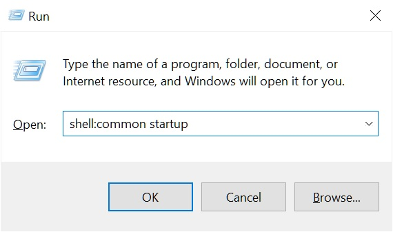

# AutoHotKey Volume Control Script

&nbsp;
## Overview
This script is a modified version of this script: https://obrienlabs.net/use-autohotkey-toggle-default-playback-sound-device  

I added a few features to the base script like microphone muting, volume adjustment, code documentation and a complete overview of the script.

&nbsp;
## Why use this script?
I've saved a lot of time and effort whenever I've had to change my volume, switch between speakers and headphones, and mute my microphone, headphones or speakers. I did these actions several times a day and it was a tedious process until I started using this script. I wanted to share this with others so they could benefit from it too.

&nbsp;
## Why and how I use this script:
I have a USB sound card (plugged into the rear of my computer) for my desktop speakers, and I use the built in headphone jack in the front of my computer for my headphones and microphone. Whenever I wanted to switch between headphones and speakers, I had to either unplug my headphones from the jack or change the device from the windows task bar speaker icon. This script turned all of that process into a single click.

This is the USB sound card I use: https://www.amazon.ca/TROND-External-Adapter-Integrated-Microphone/dp/B07L56C28R  
It acts as a separate audio device from the built in realtek audio device that handles the standard 3.5mm jacks on my computer. Some other devices you can use include HDMI sound output (from your graphics card or motherboard), PCIe sound cards, usb audio interfaces and so on. You could even find a way to logically separate one audio device into two, but I haven't found a way myself, otherwise I would have done that with the front and rear jacks of my computer.

&nbsp;
## How to use this script
Once the script is installed and running, these are the default key-combos to activate the shortcuts. They can be changed to your preference by editing the script with notepad or an IDE. (Check the section "Modifying this script")

LEGEND: Winkey = ["Windows Key"](./ignoreThisFolder/img_winkey.jpg)
* [Winkey] + [Scroll mouse wheel up] = Increase headphones/speaker volume
* [Winkey] + [Scroll mouse wheel down] = Decrease headphones/speaker volume
* [Winkey] + [Pressing mouse wheel] = Mute headphones/speaker
* [Winkey] + [z] = Mute/Unmute microphone

###### Note: Every time the audio device is changed or the microphone is muted, a text notification will display in the bottom right of your screen and fade away within 2 seconds. The notifications do not appear for volume adjustment nor for muting the headphones/speakers since windows does this already.

&nbsp;
## Requirements 
* Script:
  * [VolumeControlScript.ahk](./VolumeControlScript.ahk) (Download the project repo and use the VolumeControlScript.ahk file)
* Software:
  * [AutoHotKey](https://www.autohotkey.com/)  
  * [Nircmd.exe](https://www.nirsoft.net/utils/nircmd.html)  
  * [SoundVolumeView.exe](https://www.nirsoft.net/utils/sound_volume_view.html)

&nbsp;
## Installation
Before you start, you have to make sure your system's audio devices are named correctly.  
> 

Installing and running the script:
1. Download and install ["AutoHotKey"](https://www.autohotkey.com/)
1. Download both ["Nircmd.exe"](https://www.nirsoft.net/utils/nircmd.html) and ["SoundVolumeView.exe"](https://www.nirsoft.net/utils/sound_volume_view.html)  
1. Place the .exe files in C:\Windows\System32\  
1. Download the script: ["Volume Control Script"](https://github.com/h-cheema/Autohotkey-Volume-Control-Script/blob/master/VolumeControlScript.ahk) and place it in a reliable folder like Documents.  
1. Double click the script or right click it and click the option "Run Script".  

Setting up the script to auto run when windows starts:
1. Hold the "windows key" + "r key" to open the "run" dialog.
1. In the dialog box, enter "shell: startup" and click the OK button.
1. Place the script file in this startup folder.
> 

&nbsp;
## Modifying this script
Changing which keys do what:

The complete list of keys and actions you can use can be found here: https://www.autohotkey.com/docs/KeyList.htm

&nbsp;
## Known issues:
* If the selected audio device has no microphone, the microphone-mute button might mute your audio-output instead of muting the input-audio. Although, this shouldn't be a problem because when you switch to an audio device with no microphone, your other microphone device will not be recording anyways.

&nbsp;
## Support
If you have any questions or inquiries about this script, you can reach me at cheejin.h@gmail.com
